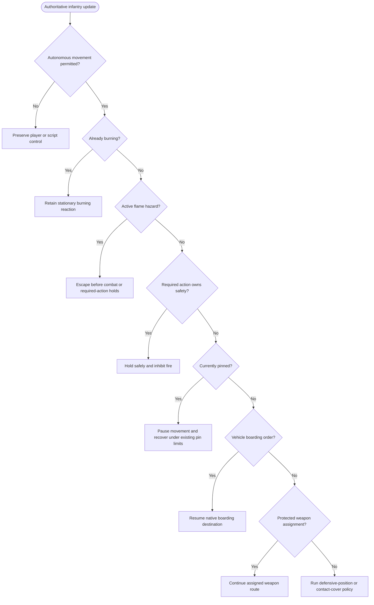
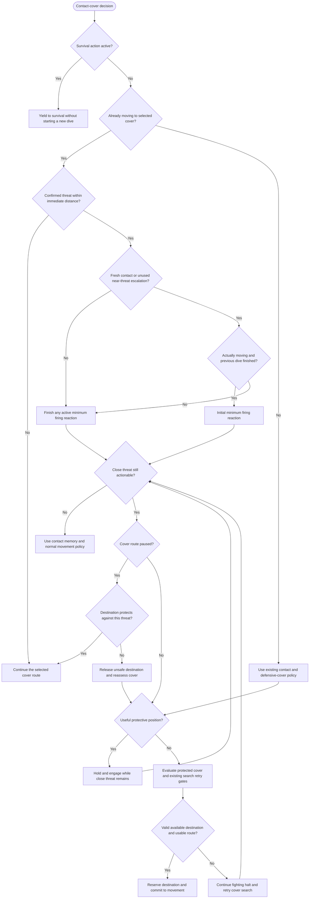

# Infantry AI decision flow

This describes the ground infantry decision changes made on September 16, 2026.
It maps the current director and contact-response code, rather than proposing a
replacement for the game's entire AI. Vehicle combat, weapon selection, perception,
and objective allocation retain their existing policies.

## Priority conflicts corrected

| Competing decisions | Earlier behavior | Corrected behavior |
|---|---|---|
| Escape active flames vs. reload, grenade throw safety, or stalled-route callback | A declared safety halt could defeat escape even though the director selected it. | Escape outranks interruptible holds in the final movement arbiter. Already-burning soldiers retain the separate stationary reaction. |
| Being pinned vs. boarding a vehicle or static weapon | Boarding had higher proposal authority; the local suppression executor could disagree with it. | The current latched pin wins. Boarding resumes when the pin clears. |
| Light suppression vs. tactical movement | The snapshot used the crouch threshold as if it meant a full pin. | Suppression updates before the snapshot; only the latched pin selects the suppression movement executor. Light suppression still affects posture. |
| New distant enemy vs. a committed move into cover | A new contact could arm a firing dive and stop the cover move. | A confirmed threat outside the immediate-threat distance does not start a dive during that move. |
| New nearby enemy vs. a committed move into cover | Contact continuity could prevent a new response even as a distant threat became close. | A close threat may trigger an initial firing reaction. Expiry reassesses protection; a paused destination must protect against the close threat before movement resumes. |
| Live close enemy vs. expired firing or attack-halt timer | Expiry could resume movement without evidence that the threat had cleared. | Continue engagement from protection or while seeking it. A live actionable close threat vetoes objective advances and charges, including advances forced by halt limits. |
| Pin or required action vs. a new firing dive | A dive could be armed before the contact FSM handled the pin. | Survival ownership is checked first; it cannot arm a competing new dive. |

## Selecting the movement executor

Player and mission-script ownership are an outer boundary. The existing player-hold
exception lets AI squadmates occupy cover within the ordered area. This change does
not take over the player's soldier or replace mission-script orders.



The runtime path is `GroundAiDirector.UpdateSoldier` through snapshot collection,
`ProposalGenerationCore.Collect`, and tactical arbitration. The final locomotion
write also passes through `MovementArbiterCore.Resolve`: a high-level decision cannot
be undone by a lower-ranked safety callback. Its survival order is burning hold,
hazard escape, required-action/stall safety, then pinning. Existing ordinary combat,
cover, and spacing ownership follows below those.

## Distance-sensitive cover movement



Distance means horizontal distance to a personally actionable, observed target.
Both the immediate acquisition callback and the regular contact FSM use
`ContactDivePolicyCore.IsImmediateThreat`. The boundary is inclusive and uses the
existing `ImmediateFireDistanceMeters` setting, scaled by AI aggressiveness
(`AiBehaviorTuning.ImmediateFireDistance`); its unscaled compiled default is
20.103 metres. No new magic distance or visibility privilege is introduced.

A confirmed enemy at 10 m can interrupt a committed cover move at the baseline
setting; one at 75 m cannot start that interruption. A continuous distant contact
that becomes close can escalate once. The same contact episode cannot repeatedly
restart the minimum reaction by changing targets or crossing the threshold. A contact
lapse starts a new episode under the existing continuity rule. Active dives finish
their existing deadline; a new proposal does not extend it. That deadline is a
reassessment point, not evidence that the enemy has been neutralized.

While a close enemy remains actionable, neither covering fire nor an expired attack
halt limit authorizes ordinary objective advance. A soldier in usable protection
continues engaging; an exposed soldier can seek cover, including outside the attack
waypoint corridor. A paused cover route is checked against the current close enemy
before resuming. If the destination is no longer protective, its reservation is
released and the ordinary cover search/retry policy takes over. Failed or deferred
searches retain the fighting halt. This allows repeated firing opportunities without
restarting the initial dive or freezing out protective movement. Losing sight is not
treated as a confirmed kill: existing contact memory and reacquisition rules apply.

Fire permission remains independently constrained by required actions, hazards,
suppression shock, moving-fire weapon rules, target acquisition, and existing
friendly-fire checks. Winning a movement decision does not itself authorize a shot.

## Verification

The deterministic scenarios cover all 16 combinations of hazard, required action,
pinning, and boarding against competing cover/assignment proposals, with contact
response enabled and disabled and proposal submission order reversed. They also
cover safety callbacks during escape, burning holds, near/far and boundary distances,
invalid distances, unseen contacts, proximity escalation, firing-deadline expiry,
persistent close threats beyond the attack halt limits, protected engagement,
exposed cover searches and retries, pin recovery, and external ownership.

Run:

```powershell
dotnet run --project tests/CommanderPlannerTests/CommanderPlannerTests.csproj -c Release
dotnet build ER2RealismOverhaul.csproj -c Release '/p:ER2GameDir=E:\SteamLibrary\steamapps\common\Easy Red 2'
```

In-game validation is still needed: observe a soldier moving toward cover with a
distant enemy, introduce a close visible enemy, and keep that enemy alive beyond the
firing deadline. Verify continued engagement or movement to protective cover, with
no timer-forced objective advance. Repeat with a destination exposed to the new
enemy to verify reassessment, then clear the contact and verify ordinary movement
recovery. Also observe a pinned boarding soldier recovering and a flame
escape occurring during a reload. The build output alone does not validate native
pathfinding, animations, or battlefield performance.
